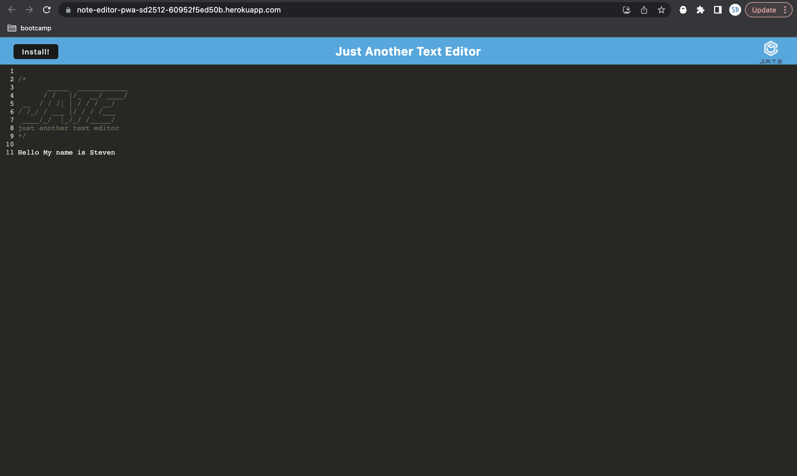
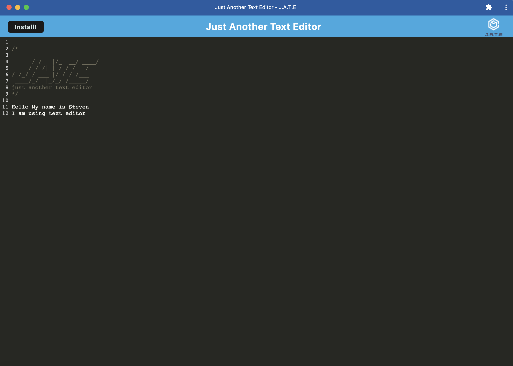
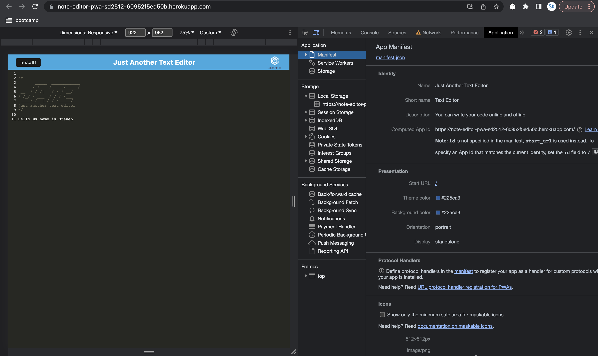
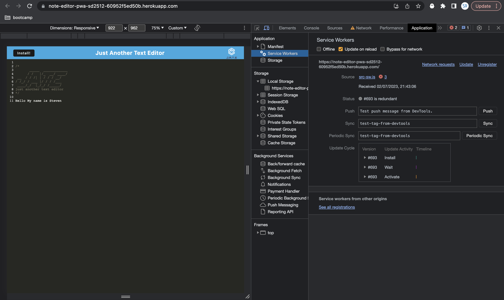

# note-editor
This is a downloadable app allows users to edit their note online and offline. 

## Description

Repository containing the code for the Text Editor Progressive Web Application (PWA). This is a both a front-end (client) and back-end (server) application that allows user input and saves it to the local storage and the local IndexedDb. 

The user is on a text editor where the user can enter any text that will be saved. The application can also be installed on user's device and available for users to use offline.

## Installation

https://note-editor-pwa-sd2512-60952f5ed50b.herokuapp.com/

### Manifest:

Manifest contains basic information about the app as well as differently sized icons.

### Service Worker:

A service worker is a JavaScript file that runs in the background of your application and can listen for and intercept network requests. 

### Webpack:

Webpack is a static module bundler that combines every module of the project into bundles and serve them.

## Usage

Users landing on homepage when they open the app. 

Users install the app to use offline. 

Mainfest from the dev tool on chrome.

Service Worker from the dev tool on chrome.

## Credits

Steven Dong

## License

Copyright (c) 2023 StevenDong2512

Permission is hereby granted, free of charge, to any person obtaining a copy
of this software and associated documentation files (the "Software"), to deal
in the Software without restriction, including without limitation the rights
to use, copy, modify, merge, publish, distribute, sublicense, and/or sell
copies of the Software, and to permit persons to whom the Software is
furnished to do so, subject to the following conditions:

The above copyright notice and this permission notice shall be included in all
copies or substantial portions of the Software.

THE SOFTWARE IS PROVIDED "AS IS", WITHOUT WARRANTY OF ANY KIND, EXPRESS OR
IMPLIED, INCLUDING BUT NOT LIMITED TO THE WARRANTIES OF MERCHANTABILITY,
FITNESS FOR A PARTICULAR PURPOSE AND NONINFRINGEMENT. IN NO EVENT SHALL THE
AUTHORS OR COPYRIGHT HOLDERS BE LIABLE FOR ANY CLAIM, DAMAGES OR OTHER
LIABILITY, WHETHER IN AN ACTION OF CONTRACT, TORT OR OTHERWISE, ARISING FROM,
OUT OF OR IN CONNECTION WITH THE SOFTWARE OR THE USE OR OTHER DEALINGS IN THE
SOFTWARE.
